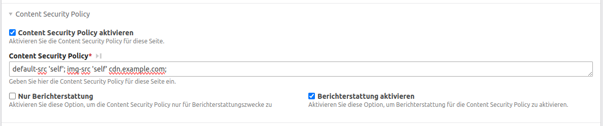

# Contao CSP Bundle

This bundle backports parts of the Content Security Policy (CSP) implementation of Contao 5.3 to Contao 4.13.

> This bundle has no handling for inline scripts and styles. You need to add `'unsafe-inline'` to your directives.



## Upgrade to contao 5

This bundle is just a backport. You can seamlessly upgrade to Contao 5.3 without touching your CSP configuration (you need to uninstall this bundle before upgrading).
Afterwards you can also remove the `'unsafe-inline'` directive from your CSP configuration as contao 5.3 has support for handling inline scripts and styles for csp.

## Installation

Install the bundle via composer or contao manager and update the database afterwards.

```bash
composer require heimrichhannot/contao-csp-bundle
```

## Configuration

Go to the root page settings. There you find an option to enable CSP. If you enable it, you can configure the CSP directives.

## Read more

[Offical documentation](https://docs.contao.org/manual/de/seitenstruktur/website-startseite/#content-security-policy)  
[Pull request](https://github.com/contao/contao/pull/6631)